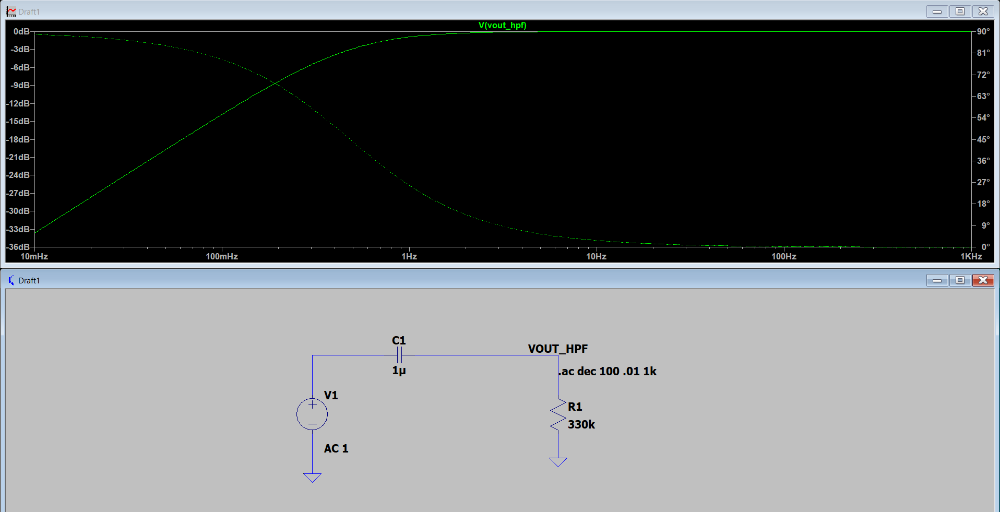
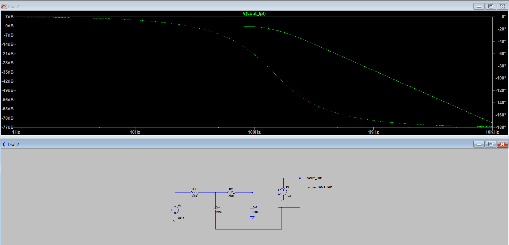
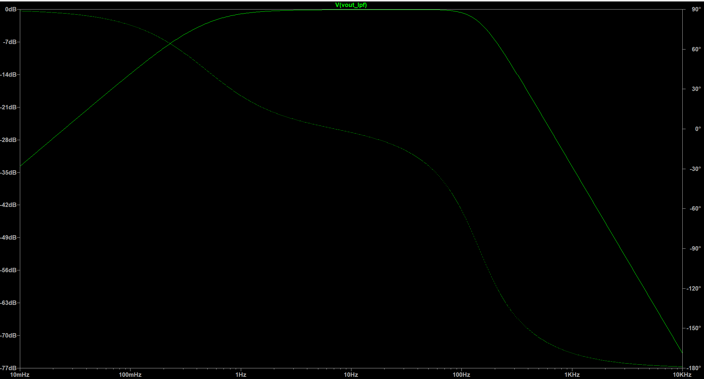

# Analog Front-End ECG

A precision ECG analog front-end designed for accurate biopotential acquisition using the INA333 instrumentation amplifier and ADS1115 16-bit ADC. The project focuses on designing, simulating, and validating each stage of the analog signal chain in LTspice before hardware implementation.

---

## Objective

Design and simulate a low-noise ECG analog front-end capable of:

- Amplifying ECG signals (0.5 mV – 5 mV)
- Rejecting common-mode interference (50 Hz mains noise)
- Removing baseline wander using a High-Pass Filter
- Limiting high-frequency noise using a Low-Pass Filter
- Providing a clean signal suitable for 16-bit ADC conversion

---

## System Architecture

```
ECG Electrodes
      │
      ▼
INA333 Instrumentation Amplifier
      │
      ▼
High-Pass Filter (0.5 Hz)
      │
      ▼
2nd-Order Sallen-Key Low-Pass Filter (150 Hz)
      │
      ▼
ADS1115 16-bit ADC
      │
      ▼
Digital Signal Processing
```

---

# Current Status

## ✅ Completed

- [x] LTspice environment setup
- [x] Three-op-amp INA333 architecture implemented
- [x] Gain verification (G = 11)
- [x] Common-mode rejection verification
- [x] Output offset verification
- [x] AC sweep (Bode analysis)
- [x] High-Pass Filter (0.5 Hz) design and simulation
- [x] 2nd-Order Unity-Gain Sallen-Key Low-Pass Filter design
- [x] Cascaded HPF + LPF simulation
- [x] Complete band-pass response verification

## 🚧 In Progress

- [ ] Official INA333 SPICE model integration
- [ ] ADS1115 interface modelling

## 📋 Planned

- [ ] Complete ECG signal-chain simulation
- [ ] KiCad schematic capture
- [ ] PCB layout
- [ ] Hardware validation
- [ ] Real ECG signal testing

---

# Instrumentation Amplifier Results

| Test | Requirement | Result | Status |
|------|------------|--------|:------:|
| Gain (Rg = 10 kΩ) | 11 ± 0.5 | 11.0 | ✅ |
| Output Center Voltage | 1.65 ± 0.05 V | 1.65 V | ✅ |
| Common-Mode Rejection | High CMRR | PASS | ✅ |
| Flat-Band Gain | 20.8 dB | 20.8 dB | ✅ |

---

# Filter Design and Simulation

## High-Pass Filter (DC Blocking)

| Parameter | Design Target | Simulated | Status |
|-----------|--------------|-----------|:------:|
| Topology | 1st-Order Passive RC | 1st-Order Passive RC | ✅ |
| Cutoff Frequency | 0.5 Hz | 0.48 Hz | ✅ |
| Roll-off | +20 dB/decade | +20 dB/decade | ✅ |
| DC Blocking | Remove baseline drift | PASS | ✅ |

**Simulation**



---

## Low-Pass Filter (Anti-Aliasing)

| Parameter | Design Target | Simulated | Status |
|-----------|--------------|-----------|:------:|
| Topology | 2nd-Order Unity-Gain Sallen-Key Butterworth | Verified | ✅ |
| Cutoff Frequency | 150 Hz | 143 Hz | ✅ |
| Roll-off | −40 dB/decade | −40 dB/decade | ✅ |
| Passband Flatness | ±0.5 dB | Within Target | ✅ |
| Peaking | None | None | ✅ |

**Simulation**



---

## Cascaded Band-Pass Filter

The High-Pass and Low-Pass filters were cascaded to obtain the complete ECG analog band-pass response.

| Parameter | Value |
|-----------|-------|
| Lower Cutoff Frequency | 0.48 Hz |
| Upper Cutoff Frequency | 143 Hz |
| Passband | 0.5 Hz – 150 Hz |
| Response | Band-Pass |

**Simulation**



---

# Design Notes

During development, the initial Sallen-Key filter simulation produced incorrect results.

The issue was traced to the ideal op-amp model.

### Fixes implemented

- Modeled the ideal op-amp using a Voltage Controlled Voltage Source (VCVS).
- Increased the VCVS open-loop gain from **1** to **1e6** to emulate an ideal operational amplifier.
- Configured the VCVS as a voltage follower.
- Correctly connected the feedback capacitor (C2) to the op-amp output according to the Sallen-Key topology.

After these corrections, the simulated response matched the expected filter characteristics.

---

# Repository Structure

```
Analog-Front-End-ECG/
│
├── README.md
│
├── ltspice/
│   ├── ina333.asc
│   ├── high_pass_filter.asc
│   ├── sallen_key_lpf.asc
│   └── cascaded_filter.asc
│
├── simulation/
│   ├── ina333_bode.png
│   ├── hpf_bode.png
│   ├── lpf_bode.png
│   └── filter_cascade_bode.png
│
├── calculations/
│   └── filter_design.pdf
│
├── docs/
│   └── project_report.pdf
│
└── hardware/
```

---

# Tools Used

- LTspice
- KiCad
- Python
- Arduino IDE

---

# Future Work

- Integrate the official INA333 SPICE model.
- Simulate complete ECG waveform acquisition.
- Design the PCB using KiCad.
- Interface with ADS1115.
- Acquire and analyze real ECG signals.
- Compare simulated and measured performance.

---

# License

This project is released under the MIT License.
